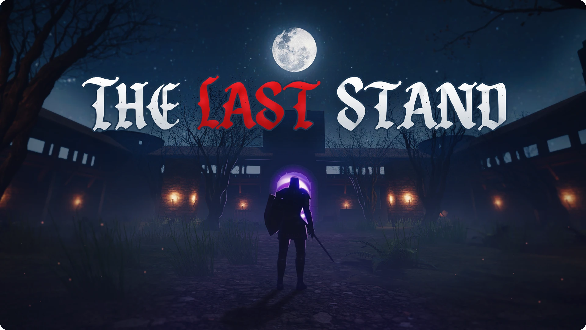

# The Last Stand

**The Last Stand** is a third-person, wave-based arena game with fast-paced, Souls-like combat. Play as a knight fending off hordes of enemies spawning from magical portals. Built as a complete overhaul of an older project, focused on improved combat feel, visuals, and enemy variety.

> 🛠️ Built in 2025 using Unity 6  
> 🎮 Game page: https://www.mikael.is/games/the-last-stand

## 🎮 About the Game

- Fend off hordes of enemies in an arena, survive as long as you can.
- The combat is inspired by Souls-like games, and features dodging, healing flasks, stamina.
- Each enemy class has its own attack patterns and behavior.

## 📦 Download

You can download the latest build from the [Releases](https://github.com/MikaelAndriIngason/the-last-stand/releases) section of this repository.

## 📄 License

See [LICENSE.md](LICENSE.md)
